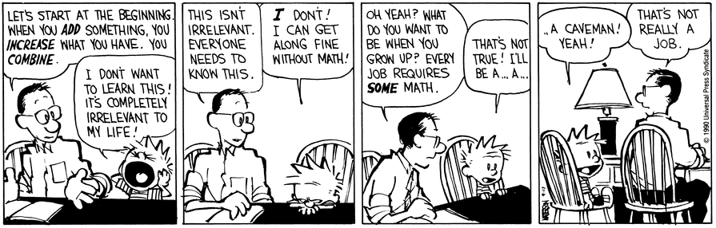
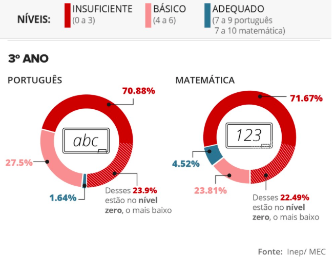
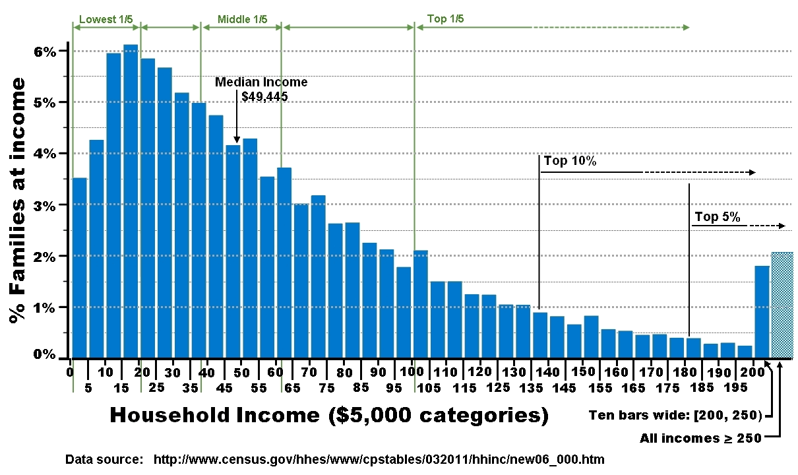
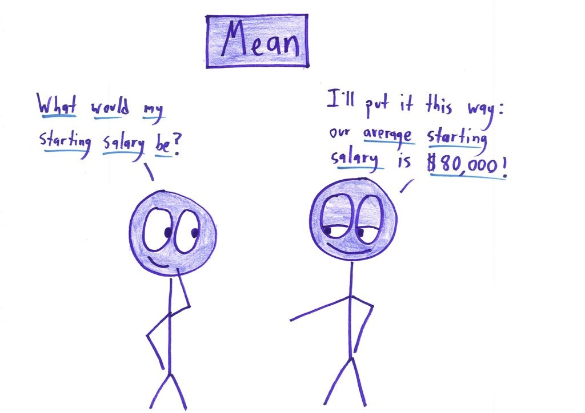
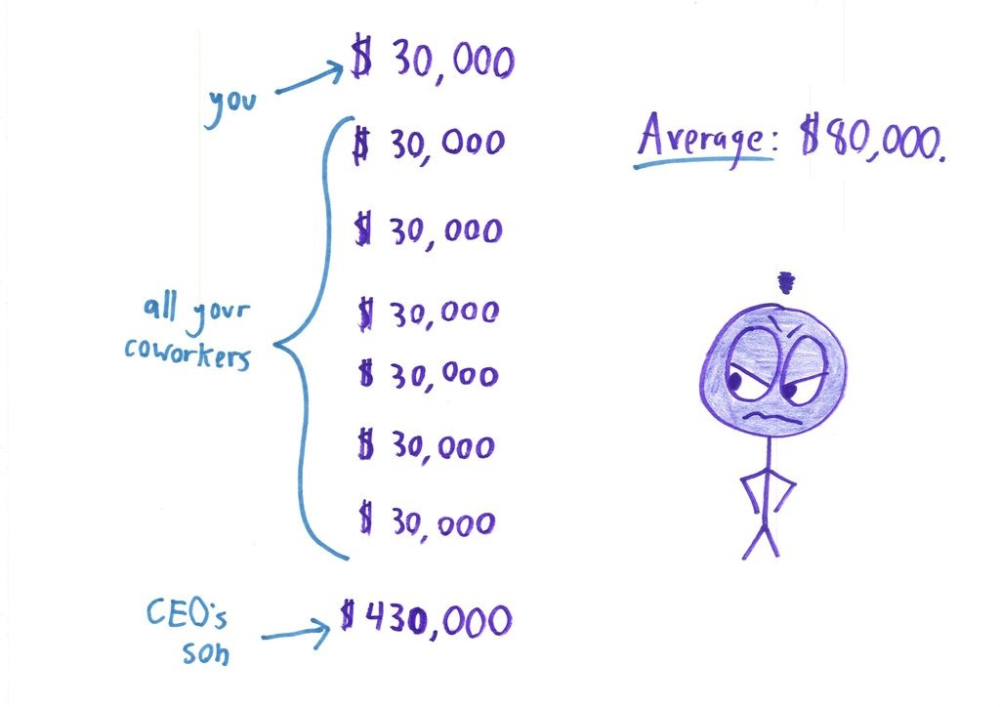
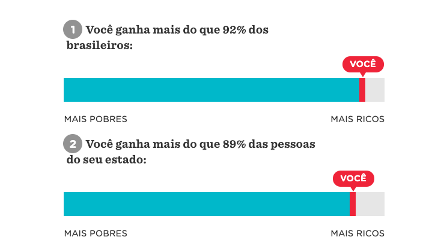
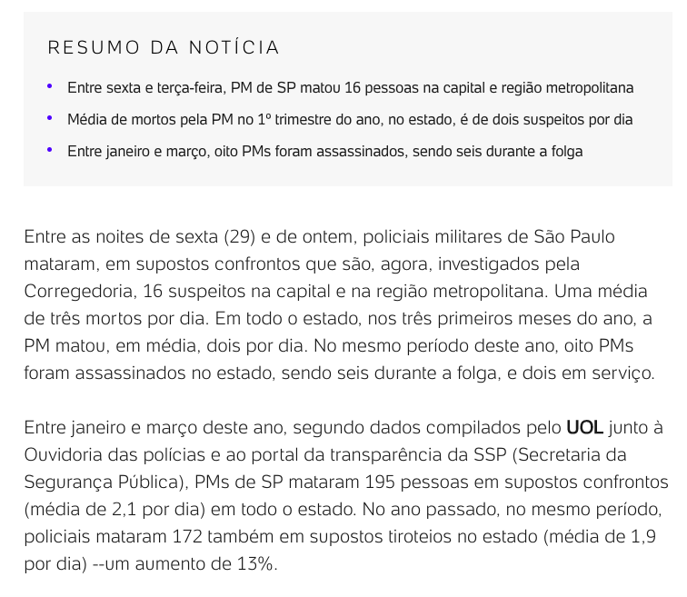
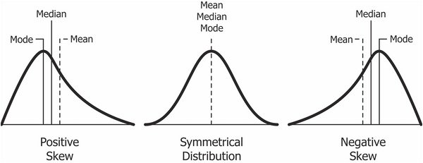
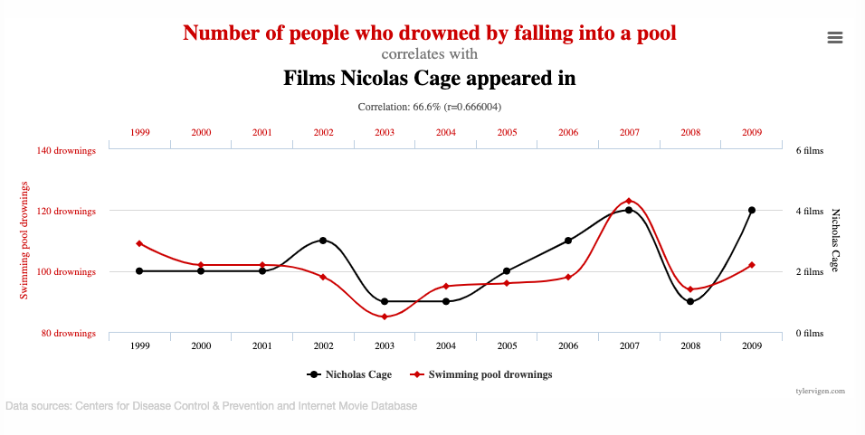
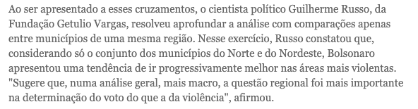

class: middle, center

## "Todo trabalho requer *algo* de matemática"
<br>

</img>
<br><br>
... e não poderia ser diferente no caso de jornalismo

---
class: middle

**Números** estão presentes em tudo: dados de segurança, de economia, de educação, saúde... Mas o grande problema, muitas vezes, é que temos muita dificuldade em interpretá-los e reportá-los.
  
Juntam-se problemas de dois tipos de _literacy_: __media literacy__ e __numeracy__

---

</img>

[G1: 7 de cada 10 alunos do ensino médio têm nível insuficiente em português e matemática, diz MEC](https://g1.globo.com/educacao/noticia/2018/08/30/7-de-cada-10-alunos-do-ensino-medio-tem-nivel-insuficiente-em-portugues-e-matematica-diz-mec.ghtml)

---
## Mas o que é _estatística_?
  
</img>

---

## Mas o que é _estatística_?
  
</img>


### __Organização__, __descrição__, __análise e interpretação__ de massas de dados 

---
### Probabilidade e distribuições: primeiros passos para entender estatística

```{r echo=F, fig.align='center', fig.width=9}

par(mfrow = c(2,2))
curve(dnorm(x, mean = 0, sd = 1), from = -5, to = 5, main = 'Normal')
curve(dchisq(x, df = 3), from = -1, to = 5, main = 'Qui-quadrado')
curve(dexp(x, rate = 0.5), from = -1, to = 5, main = 'Exponencial')
curve(dunif(x, min = 0, max = 5), from = -2, to = 7, main = 'Uniforme')

```

---
### Probabilidade e distribuições: primeiros passos para entender estatística

Os gráficos anteriores são exemplos de algumas distribuições teóricas mais comuns.
  
De forma resumida, eles representam a distribuição dos valores de uma variável.

  
Entender a distribuição dos dados ajuda a avaliar questões que surgem na análise dos dados:
  
- Frequência com que os valores (ou intervalos de valores) estão distribuídos
- Valores mais comuns, mínimos, máximos
- Variabilidade
- Valores discrepantes
- Simetria

Ferramentas importantes:
  
- Gráficos
- Tabelas
- Medidas resumo
---

### Probabilidade e distribuições: primeiros passos para entender estatística

Exemplo: __renda__

</img>

---
### Média ou mediana?

Estamos acostumados a utilizar a __média__ como medida resumo para praticamente tudo.
  
Por quê? 

---
### Média ou mediana?

Estamos acostumados a utilizar a __média__ como medida resumo para praticamente tudo.
  
Por quê? <br>
__Fácil de entender__ e __simples de calcular__
  
   
  
---
### Média ou mediana?

Estamos acostumados a utilizar a __média__ como medida resumo para praticamente tudo.
  
Por quê? <br>
__Fácil de entender__ e __simples de calcular__
  
<br><br>   
  
Quando a média deixa de ser adequada para representar seus dados?
---
### Média ou mediana?

Estamos acostumados a utilizar a __média__ como medida resumo para praticamente tudo.
  
Por quê? <br>
__Fácil de entender__ e __simples de calcular__
  
<br><br>   
  
Quando a média deixa de ser adequada para representar seus dados?
__Assimetria dos dados__ e __outliers__

---
</img>
---
</img>

[Math With Bad Drawings - Why Not to Trust Statistics](https://mathwithbaddrawings.com/2016/07/13/why-not-to-trust-statistics/)

---
class: inverse
### Exemplo: lidando com distribuição
[O seu salário diante da realidade brasileira](https://www.nexojornal.com.br/interativo/2016/01/11/O-seu-sal%C3%A1rio-diante-da-realidade-brasileira)

</img>

---

class: inverse
### Exemplo: lidando com distribuição
[O seu salário diante da realidade brasileira](https://www.nexojornal.com.br/interativo/2016/01/11/O-seu-sal%C3%A1rio-diante-da-realidade-brasileira)

- Dá ideia da distribuição de salários
- Compara valores individuais, e não valores resumidos (média)

---
class: inverse
### Exemplo: comparando números
[Em cinco dias, PM mata na Grande SP mais do que a média diária no estado](https://noticias.uol.com.br/cotidiano/ultimas-noticias/2019/04/03/em-cinco-dias-pm-mata-na-grande-sp-mais-do-que-a-media-diaria-no-estado.htm)

</img>

---
class: inverse
### Exemplo: comparando números
[Em cinco dias, PM mata na Grande SP mais do que a média diária no estado](https://noticias.uol.com.br/cotidiano/ultimas-noticias/2019/04/03/em-cinco-dias-pm-mata-na-grande-sp-mais-do-que-a-media-diaria-no-estado.htm)

- No título, dá a impressão de estar comparando a soma de mortes de 5 dias (16) com a média diária (2 por dia)
- Comparação da média de 5 dias com a média de um trimestre
- Populações diferentes

---
class: center, middle, inverse

## Medidas resumo além da média

---
## Média, Mediana, Moda

- Média: soma de todos os valores dividido pelo número de observações
- Mediana: valor central que divide as observações (ordenadas) em duas partes iguais
- Moda: Valor mais frequente

</img>
---
## Percentil / quantil

####Exemplo
Notas de uma prova de uma turma:
7,  8,  5,  2,  0,  1,  9,  8,  7,  8,  8,  8,  9,  4,  7  
  
Notas ordenadas :
0,  1,  2,  4,  5,  7,  7,  <span style="color:red">7</span>,  8,  8,  8,  8,  8,  9,  9  
  
```{r}
notas <- c(7,3,5,3,0,1,9,8,7,8,8,8,9,10,10)
mean(notas) # Média das notas
median(notas) # Mediana das notas
quantile(notas, 0.25) # Percentil 25%
```

---
## Amplitude e variância

- Amplitude: valor máximo menos o valor mínimo
- Variância: média das distâncias dos valores em relação à média, ao quadrado
- Desvio padrão: raiz quadrada da variância

```{r fig.height=4, fig.width=12, fig.align="center"}

par(mfrow=c(1,2))
curve(dnorm(x, mean = 10, sd = 2), from = 0, to = 20, main = 'Variância = 2')
curve(dnorm(x, mean = 10, sd = 8), from = 0, to = 20, main = 'Variância = 8')
```

---
## Gráficos: histograma

Gráfico que representa a frequência de observações por valor

```{r fig.align="center", fig.width=8, fig.height=6}
hist(notas)
```
---
### Gráficos: boxplot

Representa a variação de dados por meio de quartis (percentis 25%, 50%, 75%).
Interessante para comparar distribuições da mesma variável em categorias distintas.

```{r fig.align="center", fig.width=10, fig.height=5}
portugues <- notas
matematica <- c(3,3,7,6,8,4,5,6,8,8,5,5,6,10,5)
geografia <- c(2,3,3,3,1,5,3,4,2,2,4,10,4,2,4)
boxplot(data.frame(portugues, matematica, geografia), main="Distribuição de notas de provas por disciplina")
```

---
class: center, middle, inverse
## Correlação. Não. É. Causalidade.
---

class: center, middle
</img>
---
class: center, middle
</img>
---

class: center, middle, inverse
[Bolsonaro vai pior nos locais mais violentos](https://www.valor.com.br/politica/5914559/bolsonaro-vai-pior-nos-locais-mais-violentos)

</img>

---
class: center, middle, inverse

</img>

---

class: middle

Jornalismo não apenas informativo, mas também educativo
  
Isso não significa simplificar a matéria ao máximo, e sim trazer contexto suficiente e tentar lidar com assuntos complicados de maneira clara

---
### Referências
- [Math With Bad Drawings](https://mathwithbaddrawings.com/)
- [A Matemática que faz bem à Sociedade](http://www.bienasbm.ufba.br/MR1.pdf)
- [A dozen rules of thumb for journalists - Royal Statistical Society](http://www.statslife.org.uk/images/pdf/rss-number-hygiene-list-2014.pdf)
- [Spurious correlations](https://www.tylervigen.com/spurious-correlations)


### Dicas e recursos
- [Statistics every writer should know](https://www.robertniles.com/stats/)
- [Statistics for journalists: A list of resources to improve your numeracy](https://medium.com/@carmen.aguilar.garcia/statistics-for-journalists-a-list-of-resources-to-improve-your-numeracy-6d2056fa953f)
---
class: center, middle, inverse, title-slide

# Obrigada!
@renata_mh<br>
renata@voltdata.info<br>
